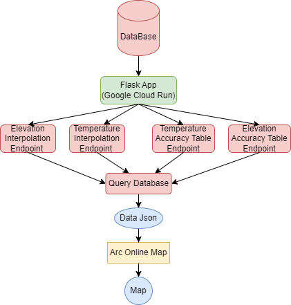
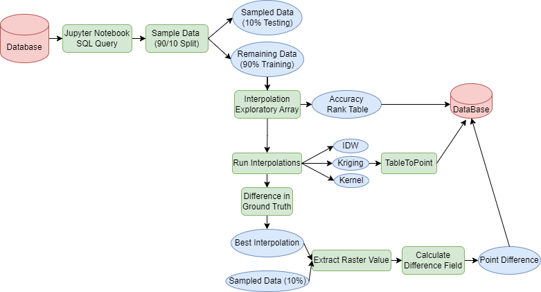

# Lab 3: Spatial Prediction

The goal of this lab is to create interpolated temperature maps for the state of Minnesota and evaluate their accuracy. The resulting maps and accuracy assessments will be stored in a database and made accessible via a Flask API endpoint for viewing on ArcOnline's MapViewer.

## Diagrams

## Contents:

Jupyter Notebooks

Elevation_Interpolation.ipynb: Queries QAQC'd elevation data, samples the dataset, runs three different interpolation algorithms, evaluates accuracy, and stores the results in the database.

Temperature_Interpolation.ipynb: Queries QAQC'd temperature data, runs three different interpolation algorithms, evaluates accuracy using appropriate metrics, and stores the results in the database.

PDF File with Video Link: Contains a link to the ArcOnline MapViewer displaying the interpolated elevation and temperature maps, accuracy assessment layers, and point differences layer.

## Key Features:

Extracts elevation and temperature point data from a database.

Samples data from both datasets, obtaining training and testing point data.

Conducts exploratory interpolation to understand the data distribution.

Utilizes IDW, Kriging, and Kernel interpolation methods for spatial estimation.

Pushes interpolated results as point data back into the database.

Performs accuracy assessment, focusing on the Kriging interpolation method.

Deploys the project on Google Cloud Run, enabling access through an API link on ArcGIS Online.

## Requirements:

Python

Jupyter Notebooks

Flask

PostgreSQL with PostGIS extension

## Helpful Links:

Google Cloud Run: https://cloud.google.com/run/docs/quickstarts/build-and-deploy/deploy-python-service

Flask App Deployment on Cloud Run Video: https://www.youtube.com/watch?v=CxzaOHTwqEI

Cross Validation: Wikipedia Article